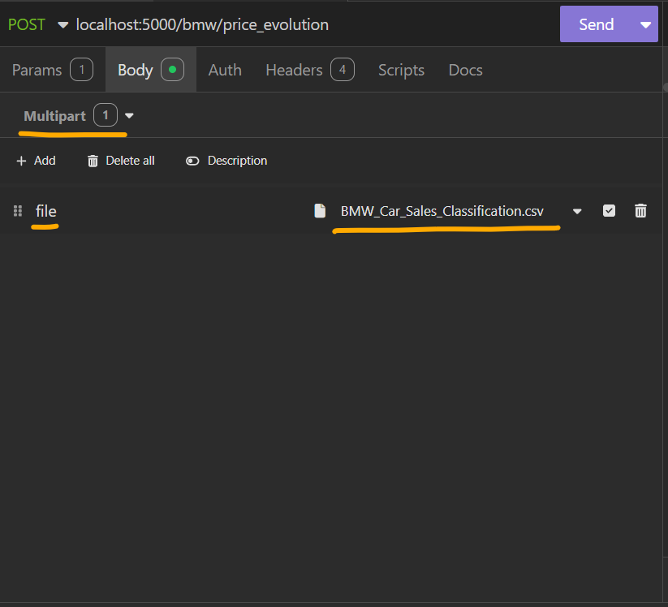

# Inside BMW

API que analisa de dados sobre a venda de carros da marca BMW. Foi desenvolvida usando Flask, Pandas e AWS.

## Dataset

A API é baseada em um dataset de vendas de carros da marca BMW. As informações foram extraídas do <a href="https://www.kaggle.com/datasets/sumedh1507/bmw-car-sales-dataset">Kaggle</a> e estão disponíveis no diretório `dataset`. As colunas são:

* **Model**: modelo do carro
* **Year**: ano referente às vendas
* **Region**: continente
* **Color**: cor do carro
* **Fuel_Type**: tipo de combustível (Diesel, Petrol, Electric, Hybrid)
* **Transmission**: tipo de transmissão
* **Engine_Size_L**: capacidade em litros
* **Mileage_KM**: quilometragem
* **Price_USD**: preço em dólar
* **Sales_Volume**: volume de vendas
* **Sales_Classification**: classificação referente ao volume de vendas. Considerada "*High*" se igual ou superior a 7000, e "*Low*" se inferior.

## Endpoints:

Para enviar um arquivo no corpo da requisição, escolha o tipo "*Multipart*", insira "*file*" no nome e selecione o arquivo `.csv` no diretório `dataset` do projeto.



### 1. Resumo
* **Rota**: `/bmw/resume`
* **Método**: `POST`
* **Corpo**: arquivo `.csv`
* **Resultado**: retorna um resumo do dataset, com algumas informações básicas

```json
{
    "length": 50000,
    "period": "2010 - 2024",
    "different_models": 11,
    "price_avg": "75.03 mil",
    "colors": [
        "Black",
        "White"
    ],
    "total": "950.60 quad"
}
```

### 2. Vendas por região
* **Rota**: `/bmw/sales_by_region`
* **Método**: `POST`
* **Corpo**: arquivo `.csv`
* **Resultado**: retorna o total de vendas, segmentado por continente.

```json
[
    {
        "Region": "North America",
        "Sales_Volume": "42.40 mi"
    },
    {
        "Region": "Middle East",
        "Sales_Volume": "42.33 mi"
    },
    {
        "Region": "Africa",
        "Sales_Volume": "41.57 mi"
    }
]
```

### 3. Evolução de popularidade de um tipo de combustível
* **Rota**: `/bmw/fuel_popularity`
* **Método**: `POST`
* **Corpo**: arquivo `.csv`
* Query Param: `?fuel_type=` (um entre "Petrol", "Diesel", "Electric" ou "Hybrid")
* **Resultado**: retorna o volume de vendas de um tipo de combustível ao longo dos anos, O que possibilita, por exemplo, analisar se carros elétricos estão ficando mais populares. Também retorna a diferença com o ano anterior

```json
[
	{
		"Year": 2014,
		"Sales_Volume": "4.02 mi",
		"evolution": "-94.77 mil"
	},
	{
		"Year": 2015,
		"Sales_Volume": "4.22 mi",
		"evolution": "192.33 mil"
	},
	{
		"Year": 2016,
		"Sales_Volume": "4.20 mi",
		"evolution": "-15.23 mil"
	},
]
```

### 4. Modelos coloridos mais vendidos
* **Rota**: `/bmw/colorful_winners`
* **Método**: `POST`
* **Corpo**: arquivo `.csv`
* Query Param: `?colorful=` (true ou false)
* **Resultado**: Os carros são classificados como coloridos (todas as cores, exceto preto e branco) ou não coloridos (preto ou branco). O endpoint agrega o volume de vendas por modelo na categoria escolhida e retorna os modelos mais vendidos. Use `?colorful=true` para coloridos ou `?colorful=false` para não coloridos. Exemplo: com `colorful=true`, são retornados os modelos de carros coloridos mais vendidos.

```json
[
	{
		"Model": "7 Series",
		"Sales_Volume": "8.01 mi"
	},
	{
		"Model": "i8",
		"Sales_Volume": "7.86 mi"
	},
	{
		"Model": "X5",
		"Sales_Volume": "7.85 mi"
	}
]
```

### 5. Evolução de preço
* **Rota**: `/bmw/price_evolution`
* **Método**: `POST`
* **Corpo**: arquivo `.csv`
* **Resultado**: retorna a evolução de preço de todos os modelos ao longo dos anos.
```json
[
	{
		"Model": "7 Series",
		"2010": "76.13 mil",
		"2011": "74.53 mil",
		"2012": "75.96 mil",
		"2013": "76.76 mil",
		"2014": "77.82 mil",
		"2015": "74.63 mil",
		"2016": "77.35 mil",
		"2017": "75.14 mil",
		"2018": "74.89 mil",
		"2019": "77.55 mil",
		"2020": "73.02 mil",
		"2021": "74.13 mil",
		"2022": "74.48 mil",
		"2023": "76.24 mil",
		"2024": "75.33 mil"
	}
]
```

## Como Testar

### Como Testar usando Python

#### Pre-Requisitos
* Python 3.x
* Pip

#### Passo a Passo
1. Use `pip install -r image/requirements.txt` para instalar as dependências da API
2. Use `py image/main.py` para iniciar a API
3. Ela estará disponível em "*localhost:5000*"

### Como Testar usando Docker

#### Pre-Requisitos
* Docker

#### Passo a Passo
1. Inicie o *Docker Desktop*
2. Use `cd image` para acessar o diretório do projeto
3. Use `docker build . -t bmw-api` para construir a imagem *Docker* da API
4. Use `docker run -p 5000:5000 bmw-api` para iniciar a API
5. Ela estará disponível em "*localhost:5000*"

### Como fazer Deploy usando CDK

#### Pre Requisitos
* Python
* Pip
* Docker
* AWS CLI
* CDK

#### Passo a Passo
1. Use `aws configure`, passando as suas chaves de acesso, para autenticar o ambiente à AWS
2. Use `pip install -r requirements.txt` para instalar as depedências do CDK

> Note que esse é um arquivo diferente do instalado na etapa "*Como Testar em Python*". Enquanto aquele é referente as bibliotecas da API, este é referente a infraestutura.

3. Inicie o *Docker Desktop*
4. Use `cdk bootstrap`, caso essa seja seja primeira vez usando CDK, para instanciar os recursos básicos.
5. Use `cdk synth`, para visualizar os recursos que serão criados
6. Use `cdk deploy --require-approval never` para publicar o projeto na nuvem
7. Após o fim do deploy, o CLI irá exibir o endereço da API em `AppRunnerServiceUrl = suaapi.aws.com`
8. Você também poderá consulta-la no console da AWS

## Tecnologias

* **Python**: linguagem de programação para desenvolvimento do projeto
* **Flask**: biblioteca para aplicações web. Usada para desenvolver a API
* **Pandas**: biblioteca para manipulação de dados. Usada para processar os dados CSV
* **AWS**: serviço de cloud computing da Amazon. Usada para hospedar a API
* **AppRunner**: serviço serveless da AWS para publicar containers na nuvem. Usado para subir a API
* **Docker**: tecnologia para construção de imagens para containers. Usado para criar as imagens a serem publicadas no AppRunner
* **CDK**: kit de desenvolvimento da AWS, cujo objetivo é a formação de Infraestrutura como códgo (IaC). Usada para criar o AppRunner de forma automática, dispensando a configuração manual via console da AWS